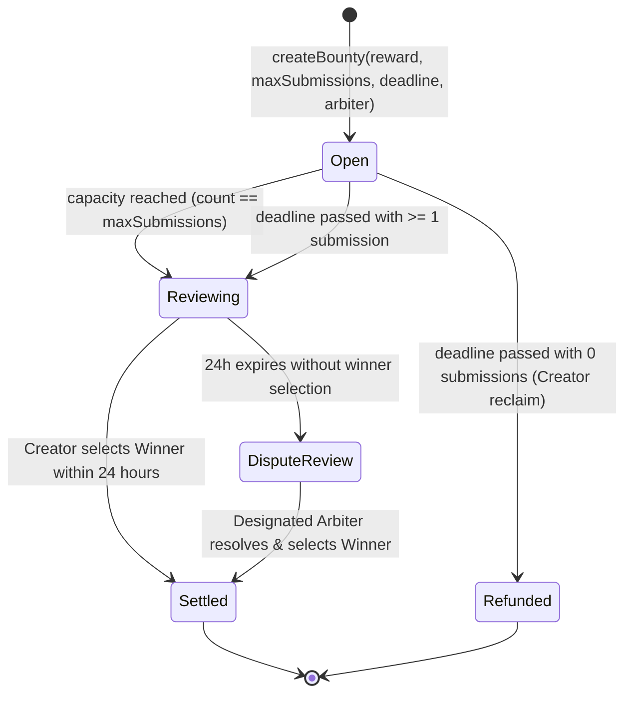

# SettleX V2: Permissionless Onchain Work Bounty System

## 1. Executive Summary

**SettleX V2** replaces bilateral buyer/seller escrow with a **Permissionless Onchain Work Bounty Protocol** designed for high-velocity decentralized ecosystems like **Monad**.

The core philosophy of SettleX V2 is:
> **"Work first. Payment guaranteed by code."**

In V2, any **Creator** can lock funds upfront to sponsor a task with immutable **Acceptance Criteria**, enforceable submission caps (1–10 submissions), and a dedicated 24-hour review window. Any eligible **Contributor** can discover bounties, review the criteria, and submit work permissionlessly without requiring upfront deposits or gatekeepers. 

Once submissions close, the Creator reviews the submissions against the immutable criteria and selects **one Winner**. The protocol automatically splits the locked reward:
- **80%** directly to the **Winner**.
- **20%** distributed equally as **Participation Rewards** to all other valid non-winning Contributors.
- Any integer division dust is allocated to the Winner so zero wei remains stranded.

---

## 2. Terminology & Conceptual Model

SettleX V2 strictly deprecates bilateral escrow naming. The system is defined exclusively by the following roles and primitives:

| Entity | Definition |
| :--- | :--- |
| **Creator** | The wallet entity creating and funding the Bounty with native MON. |
| **Contributor** | Any independent wallet submitting work/proof against the Acceptance Criteria. |
| **Bounty** | The onchain work unit encapsulating reward, deadline, criteria, and submission limits. |
| **Submission** | A Contributor's proof-of-work link and metadata registered onchain. |
| **Winner** | The single Contributor selected by the Creator (or Arbiter) who receives 80% of the reward. |
| **Participation Reward** | The 20% pool distributed equally among all other valid Contributors. |
| **Acceptance Criteria** | Immutable rules and quality requirements set at creation time. |
| **Review Period** | A strict 24-hour window from submission closure during which the Creator must pick a Winner. |
| **Dispute Review** | An escalation state reached if the Creator fails to select a Winner within 24 hours. |
| **Arbiter** | An optional trusted third-party wallet designated at creation time to resolve disputes. |

---

## 3. Core Lifecycle & State Machine



### State Definitions

1. **`None (0)`**: Non-existent bounty ID.
2. **`Open (1)`**: Accepting submissions. Contributor slots available and deadline is in the future.
3. **`Reviewing (2)`**: Submissions are closed. The 24-hour review timer is ticking.
4. **`DisputeReview (3)`**: Creator failed to select a Winner within 24 hours. Awaiting designated Arbiter resolution.
5. **`Settled (4)`**: Terminal state. Winner paid 80% (+ dust), non-winning contributors paid their equal share of 20%.
6. **`Refunded (5)`**: Terminal state. Deadline passed with 0 submissions; Creator reclaimed 100% of the locked MON.

---

## 4. Submission Rules & Onchain Enforcement

1. **Capacity Limit (1–10)**:
   - Creator specifies `maxSubmissions` between `1` and `10` inclusive.
   - Any attempt to create a bounty with `0` or `> 10` slots reverts immediately.
   - The $(N+1)$-th submission reverts onchain.
2. **One Submission Per Contributor**:
   - Each contributor wallet can submit at most once per bounty.
   - Duplicate submissions from the same address revert with `AlreadySubmitted`.
3. **Creator Exclusion**:
   - The Creator wallet cannot submit work to their own bounty (`CreatorCannotSubmit`).
4. **Protocol Validity vs. Quality**:
   - The smart contract verifies protocol validity: timestamp $\le$ deadline, capacity available, non-empty proof URI, non-creator address, no duplicate submissions.
   - The contract **does not** judge work quality; quality is judged offchain against the immutable Acceptance Criteria by the Creator during the Review Period (or by the Arbiter during Dispute Review).

---

## 5. Reward Distribution Mathematics

Let the total reward locked in the bounty be $R$.

### Case 1: Standard Multi-Contributor Bounty ($S \ge 2$)
Where $S$ is the total count of valid submissions:
- **Winner Payout**:
  $$\text{WinnerBase} = \lfloor R \times 0.80 \rfloor$$
- **Participation Pool**:
  $$\text{Pool} = R - \text{WinnerBase} \quad (\approx 20\%)$$
- **Other Contributors**:
  $$\text{OtherCount} = S - 1$$
- **Per-Contributor Reward**:
  $$\text{PerContributor} = \lfloor \frac{\text{Pool}}{\text{OtherCount}} \rfloor$$
- **Dust Handling**:
  $$\text{Dust} = \text{Pool} - (\text{PerContributor} \times \text{OtherCount})$$
  $$\text{FinalWinnerPayout} = \text{WinnerBase} + \text{Dust}$$
- **Verification**:
  $$\text{FinalWinnerPayout} + (\text{PerContributor} \times \text{OtherCount}) \equiv R$$
  *Result: Zero wei left stranded in the contract.*

### Case 2: Single Valid Submission ($S = 1$)
If exactly one Contributor submits before closure:
- Creator selects that Contributor as Winner.
- **Winner Payout**: $\lfloor R \times 0.80 \rfloor$.
- **Unused Participation Pool (20%)**: Returned directly to the Creator.
- *Reasoning*: The lone Contributor is not rewarded with the participation pool intended for other participants; the unused pool is returned to the sponsor.

### Case 3: Zero Valid Submissions ($S = 0$)
- If the submission deadline passes with 0 submissions, the Creator calls `claimExpiredBountyRefund(bountyId)`.
- **100% of $R$** is refunded to the Creator.
- Bounty transitions to `Refunded`.

---

## 6. Dispute Resolution & Future Decentralized Jury

SettleX V2 isolates dispute resolution authority from the core bounty contract logic:

```
[Bounty Lifecycle] ──> [ReviewWindow Expired] ──> [DisputeReview]
                                                        │
                                                        ▼
                                             [disputeResolver Authority]
                                          ┌─────────────┴─────────────┐
                                          ▼                           ▼
                                    [Current V2]                 [Future V3]
                               Constrained Resolver/Arbiter   Decentralized Jury (3/5/7)
                                          │                           │
                                          └─────────────┬─────────────┘
                                                        ▼
                                             resolveDispute(id, winId)
                                                        │
                                                        ▼
                                            [Smart Contract Settlement]
                                          (80% Winner / 20% Participants)
```

### Current V2: Constrained Dispute Resolver
1. **Review Period Trigger**:
   - Submissions close automatically when `submissionCount == maxSubmissions` or `block.timestamp >= submissionDeadline`.
   - `reviewDeadline = block.timestamp + 24 hours`.
2. **Creator Review Window**:
   - For exactly 24 hours, the Creator evaluates submissions against the immutable Acceptance Criteria and calls `selectWinner(bountyId, winnerSubmissionId)`.
   - **NO "Reject All"**: There is deliberately no reject-all button or creator refund once valid submissions exist. The Creator must pick the best submission meeting criteria.
3. **Dispute Review Escalation**:
   - If the Creator goes inactive and fails to select a winner within 24 hours, anyone can call `escalateToDispute(bountyId)`.
   - The contract transitions permanently to `DisputeReview`.
4. **Constrained Resolver Authority**:
   - Only the configured `disputeResolver` address can call `resolveDispute(bountyId, winnerSubmissionId)`.
   - **Strict Constraints on Resolver**:
     - Resolver can **only** act when state is `DisputeReview`.
     - Resolver can **only** select an existing valid submission ID ($1 \le \text{winnerSubmissionId} \le \text{submissionCount}$).
     - Resolver **cannot** alter the reward, change deadlines, modify Acceptance Criteria, redirect funds, or extract fees.
     - Payout executes strictly through the verified 80/20 distribution logic (+ dust to Winner).
     - Resolver **cannot** resolve twice; settlement is terminal.
   - If no dispute resolver was configured, funds remain safely protected in `DisputeReview` without dangerous automatic split payouts to low-effort spammers.

---

### Future V3: Decentralized Jury System

SettleX V2 is architected specifically so that a Decentralized Jury can be plugged in without rewriting or modifying the core `SettleXBounty` contract.

#### Conceptual V3 Jury Architecture:
1. **Juror Registry**: Maintain a registry of approved, bonded Jurors who meet qualification and stake thresholds.
2. **Dynamic Juror Selection**: When a bounty enters `DisputeReview`, the jury contract selects 3, 5, or 7 Jurors using verifiable randomness.
3. **Acceptance Criteria Evaluation**: Each juror reviews the deliverable proofs independently against the onchain immutable Acceptance Criteria.
4. **Majority Voting Round**: Jurors cast confidential/commit-reveal votes for the candidate submission that best satisfied criteria.
5. **Onchain Settlement Execution**: Once majority (e.g. 2-of-3 or 4-of-7) is reached, the Jury contract calls:
   ```solidity
   ISettleXBounty(bountyContract).resolveDispute(bountyId, majorityWinnerId);
   ```
6. **Incentives & Slashing**: Jurors voting with the majority share an arbitration fee; minority or non-participating jurors are slashed.

#### Why V3 is Not Implemented Yet (Honest Engineering Scope):
- **Sybil Resistance & Identity**: Developing a robust juror registry requires proof-of-humanity or established reputation primitives.
- **Verifiable Random Selection**: Needs secure onchain randomness (such as Monad VRF) to avoid validator or miner manipulation.
- **Juror Staking & Slashing Mechanics**: Requires comprehensive economic simulations to ensure arbitration stakes prevent collusion.
- **Voting Game Theory**: Commit-reveal schemes are required to prevent follow-the-leader voting cartels.

SettleX V2 is honestly described as a **permissionless bounty protocol with a constrained dispute-resolution layer, cleanly abstracted for future decentralized jury integration**.

---

## 7. Security Architecture

1. **OpenZeppelin ReentrancyGuard**: Applied to all state-changing functions with external value transfers (`createBounty`, `selectWinner`, `resolveDispute`, `claimExpiredBountyRefund`, `claimReward`).
2. **Checks-Effects-Interactions (CEI)**: State transitions and storage updates occur strictly before any external ETH/MON transfers.
3. **Pull-Payment Fallback for Resilient Distribution**:
   - If a Contributor is a smart contract that reverts on direct native transfer, the transaction **does not revert** or block the Winner from getting paid.
   - Instead, the payout is safely credited to `claimableRewards[recipient]`, emitting a `RewardClaimQueued` event.
   - The recipient can withdraw their reward anytime via `claimReward()`.
4. **Immutable Metadata**: Task title, description, and acceptance criteria URIs are set at creation time and cannot be updated afterwards.
5. **No Protocol Admin Drain**: No owner or protocol admin keys have backdoors to extract bounty deposits.

---

## 8. Monad Testnet Deployment Guide

### Contract Deployment
```bash
cd contracts
source .env
forge script script/DeploySettleXBounty.s.sol:DeploySettleXBounty \
  --rpc-url https://testnet-rpc.monad.xyz \
  --broadcast \
  --verify
```

### Environment Configuration
Update `.env` in `frontend/`:
```env
NEXT_PUBLIC_SETTLEX_BOUNTY_ADDRESS="<DEPLOYED_BOUNTY_ADDRESS>"
NEXT_PUBLIC_MONAD_RPC_URL="https://testnet-rpc.monad.xyz"
NEXT_PUBLIC_CHAIN_ID=10143
```
