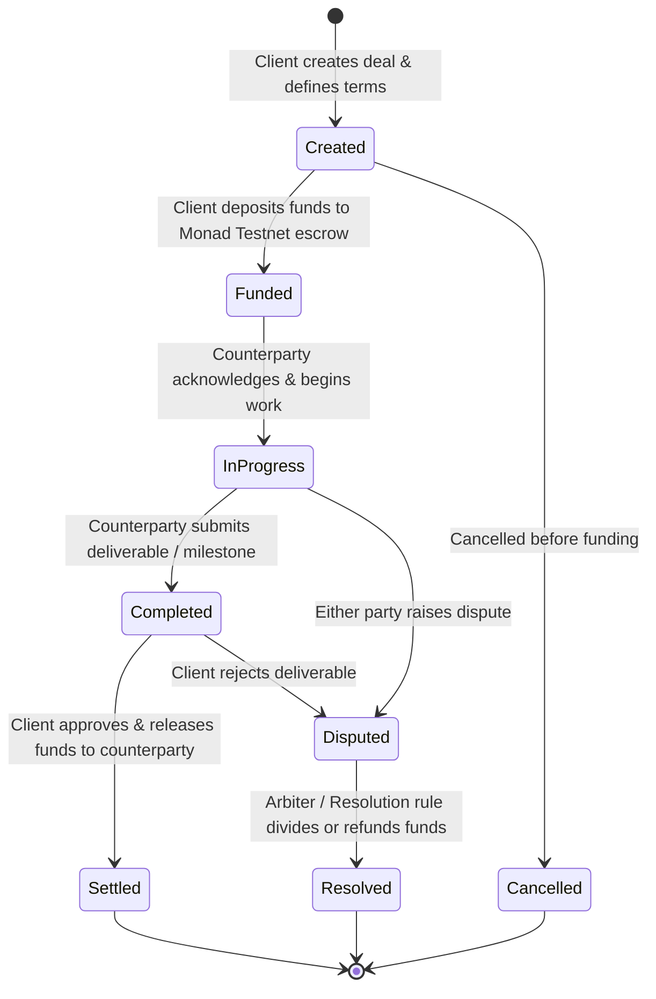

# SettleX Planned Escrow Flow

## 1. Role Definitions
- **Client (Buyer / Depositor)**: Initiates or accepts the deal terms and funds the escrow.
- **Freelancer / Counterparty (Seller / Beneficiary)**: Delivers goods or services specified in the agreement.
- **Third-Party Arbiter (Optional / Designated)**: Addresses dispute resolution if either party flags a conflict.

---

## 2. Planned Escrow Lifecycle

---

## 3. Step-by-Step Flow

### Phase A: Deal Creation
1. Either participant initiates a new deal by defining:
   - Counterparty address
   - Escrow amount (in native MON or ERC20)
   - Deal milestones & descriptions
   - Deadline / expiration timestamp
   - Arbiter address (optional or default)

### Phase B: Funding
2. The Client commits and locks the agreed funds into the SettleX Escrow smart contract on Monad Testnet.
3. Funds remain locked trustlessly in the contract until contractual release criteria are met.

### Phase C: Execution & Submission
4. The Freelancer undertakes work and marks milestones as submitted once deliverables are provided.

### Phase D: Review & Settlement
5. The Client reviews work:
   - **Approval**: Triggers an automated onchain payout directly to the Freelancer's wallet address.
   - **Revision Request**: Both parties can coordinate offline or through onchain status signals.

### Phase E: Dispute Resolution
6. If a disagreement cannot be resolved amicably:
   - A dispute can be raised before funds expire.
   - Designated arbiter or pre-agreed conditions determine distribution (full refund to client, full release to freelancer, or proportional settlement).

---

## 4. Network Note
- Developed exclusively for **Monad Testnet** for high throughput, sub-second finality, and negligible gas fees.
- Mainnet readiness or deployment has **not** been determined at this phase.
